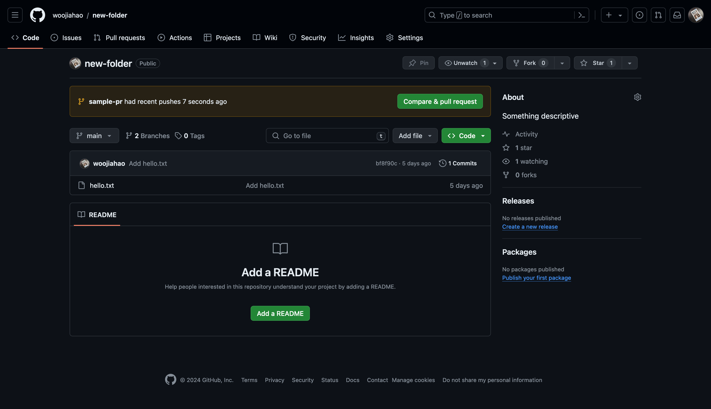

---
layout:
  title:
    visible: true
  description:
    visible: false
  tableOfContents:
    visible: true
  outline:
    visible: true
  pagination:
    visible: true
---

# Pull Requests (PRs)

Pull requests are similar to [Request for Comments (RFCs)](https://en.wikipedia.org/wiki/Request\_for\_Comments) for a set of changes made on a separate branch (on the same or different remote repository). They allow other contributors/developers to share their comments about the changes made and allows the creator of the pull request to improve their changes before they are merged into the `main` branch (or any branch for that matter).

Pull requests are the cornerstone of collaborative workflows. While you may be able to push directly to a remote repository (provided that you have been added as a [collaborators.md](../advanced-concepts/github-specific/collaborators.md "mention")), it opens up the possibility of having conflicting changes/overriding changes.

## Creating a pull request

To create a pull request, you first have to push a local branch to a remote repository. For now, we will work with the same repository you had created earlier.

```
git checkout -b sample-pr
vim hello.txt
git add hello.txt
git commit -m "new changes"
git push origin sample-pr
```

Then, go to the Github page of the repository. You should see this yellow textbox show up:

<figure><figcaption></figcaption></figure>

You can create a pull request directly from the "Compare & pull request" button in the yellow box.

However, we would like to orient you to the Github PR UI a little more. So you can click on the "Pull requests" tab and you will see the following page:

<figure><figcaption></figcaption></figure>

Right now, there isn't a lot going on. However, there are two key UI components that you should take note of. The first is the search bar that supports [advanced search syntax](https://docs.github.com/en/search-github/searching-on-github/searching-issues-and-pull-requests). The other is the "New pull request" button which we will use to create this PR. The large space in the second half of the page will display all open PRs (if any).

<figure><figcaption></figcaption></figure>

The most important step here is selecting the source and target branch (both remote). These are the branches used for merging as detailed in [#combining-changes-of-branches](../fundamental-concepts/branching.md#combining-changes-of-branches "mention"). So, the source branch is the `compare` branch in the UI and the target branch is the `base` branch.

If you are following along, you can select the dropdown for `compare` and you should see the following options:

<figure><figcaption></figcaption></figure>

You can select the `sample-pr` branch that we pushed earlier and you should see the UI updated with the changes made in the branch:

<figure><figcaption></figcaption></figure>

Once you have selected your source and target branches, you can select "Create pull request". Then, you will be prompted to enter some additional details about the PR:

<figure><figcaption></figcaption></figure>

1. Title: quick summary of the PR&#x20;
2. Description: details about the PR such as what the PR contains, what it aims to resolve, etc.
3. Reviewers: who is going to check and verify these changes
4. Assignees: who is actively working on these changes (usually the person creating the PR)
5. Labels: tags for the PR (useful for filtering and searching)
6. Projects: associates the PR with a specific [Github project](https://docs.github.com/en/issues/planning-and-tracking-with-projects/learning-about-projects/about-projects)
7. Milestone: associates the PR with a [specific milestone set](https://docs.github.com/en/issues/using-labels-and-milestones-to-track-work/about-milestones)

The only mandatory field is the title field. So, for now, we can leave the title as it is or give it a new value. Then, you can create the PR:

<figure><figcaption></figcaption></figure>

There is a new UI component representing the CI/CD actions that may have been run on the repository. We will cover this later on under [ci-cd-with-github-actions.md](../advanced-concepts/github-specific/ci-cd-with-github-actions.md "mention").

Here in the PR preview, you can add/view the comments made.

For now, we can merge the PR by selecting "Merge pull request". Then, confirm the merge and when you navigate back to the main repository page and view the file `hello.txt`, you would see your changes from the branch added to the `main` branch.

Wonderful! Now that we have established what PRs are and how they can be created, we can look at how we can employ them for collaborative workflows.
